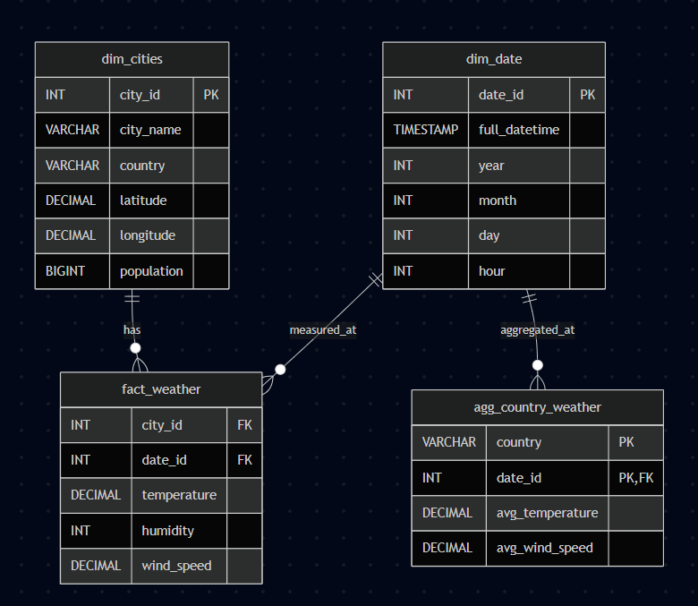
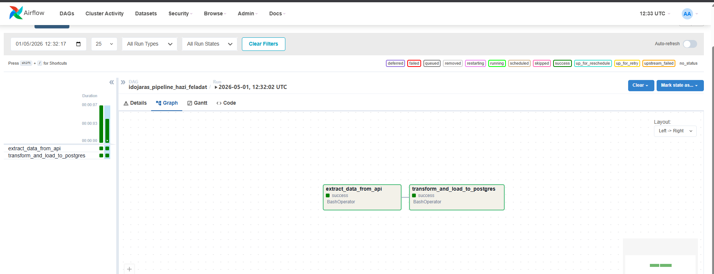
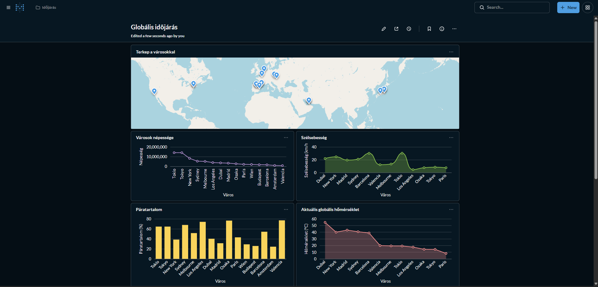
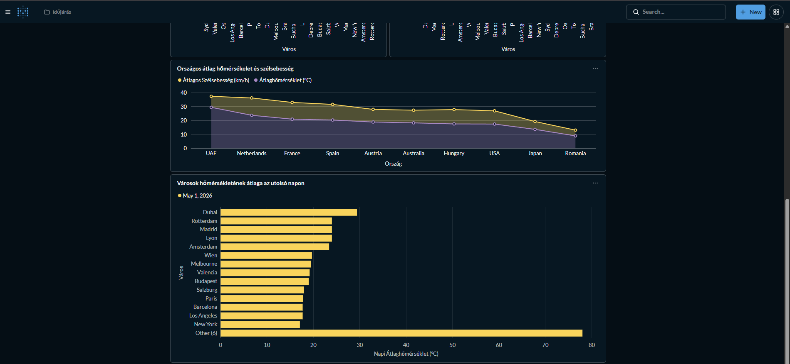

# Városok időjárás pipeline
**Data Engineering Opcionális Házi Feladat**

Ez a projekt egy teljes, end-to-end data engineering pipeline, amely kiválasztott világvárosok időjárási adatait és statikus metaadatait integrálja. A rendszer napi szinten gyűjt, tisztít és transzformál adatokat, hogy azokat egy adattárházban elemezhetővé és egy dashboardon vizualizálhatóvá tegye.

---

## 1. Architektúra és Indoklás

A pipeline egy modern, lokális, konténerizált adatplatformot valósít meg az alábbi technológiák segítségével:

* **Adatforrások (Extract):** 
  * **REST API:** Open-Meteo API (szemistrukturált JSON adatok az aktuális időjárásról).
  * **Lokális fájl:** `cities.csv` (strukturált adatok a városokról: koordináták, népesség).
* **Adattárolás (Storage):** 
  * **Landing Zone:** Lokális fájlrendszer (`data/landing_zone`), ahová az API-ból kinyert nyers JSON fájlok érkeznek.
  * **Data Warehouse:** PostgreSQL relációs adatbázis, amely egy optimalizált csillag sémát tárol.
* **Transzformáció (Transform):** Python (Pandas) alapú feldolgozás. A szemistrukturált adatok lapítása (flattening), null-értékek kezelése, típuskonverziók és aggregációk elvégzése történik a betöltés előtt.
* **Orkesztráció (Orchestration):** Apache Airflow. Kezeli a feladatok (taskok) függőségét, ütemezését (fél óránkénti futás) és biztosítja a folyamat **idempotenciáját**.
* **Vizualizáció (Serving):** Metabase, amellyel az adatbázisra csatlakozva interaktív dashboardok készíthetők.
* **Infrastruktúra:** Docker Compose. Az egész rendszer (Postgres, Airflow, Metabase) egyetlen paranccsal, reprodukálhatóan elindítható.

---

## 2. Adatmodell (Csillag séma)

Az adattárház tervezése során a klasszikus Kimball-féle csillag sémát (Star Schema) alkalmaztuk az analitikai lekérdezések (OLAP) gyorsítása érdekében.



---

## 3. Futtatás és Használat

Futtatás előtt a `.env.example` fájl nevét át kell írni `.env`-re, vagy hozz létre egy sajátot a szükséges változókkal.

A projekt teljes infrastruktúrája konténerizálva van, így a futtatása mindössze pár lépésből áll:

1. A terminálban a projekt gyökérmappájába állva add ki az alábbi parancsot a Docker konténerek elindításához:
   ```bash
   docker-compose up -d
   ```
2. Ezt követően nyisd meg a `http://localhost:8080` címet a böngészőben. Itt éred el az **Airflow** grafikus felületét. A `.env` fájlban megadott felhasználónévvel és jelszóval tudsz bejelentkezni, majd elindítani a DAG-ot.



3. Az analitikai adatbázisra kötött **Metabase BI Dashboardot** a `http://localhost:3000` címen éred el. 
   Az első indításkor egy fiók létrehozása szükséges az adatok vizualizációjához. Ezt követően a Metabase kérni fogja az adatbázis-kapcsolat beállítását. Ehhez a következő adatokat kell megadni (a Docker hálózat és a `.env` fájl alapján):
   * **Adatbázis típusa (Database type):** PostgreSQL
   * **Név (Name):** weather_db (vagy tetszőleges név a Metabase felületén)
   * **Host:** `postgres` *(Fontos: nem localhost, mert a konténerek a "postgres" néven látják egymást)*
   * **Port:** 5432
   * **Adatbázis neve (Database name):** `weather_db`
   * **Felhasználónév (Username):** `airflow`
   * **Jelszó (Password):** `airflow`

4. A Metabase felületén a dashboard létrehozásának lépései:
   1. Új kollecsion létrehozása a bal oldali menü sávban, ennek tetszőleges nevet adhatunk.
   2. Ezt követően a jobb felső sarokban található new gombra kattintva válasszuk ki a Dashboard opciót. Ezzel létrehozva a Dashboard felületét.
   3. Ehhez kell hozzáadni a new SQL query segítségével a lent található lekérdezéseket és a bal alsó sarokban található Visualization gombbal hozhatjuk létre a grafikonokat.
   4. Ezt követően mentsük el a grafikont a Save gombbal és megjelenik a dashboardon.

5. A konténereket a `docker-compose down` paranccsal tudjuk leállítani.

---

## 4. Analitikai lekérdezések és Dashboard

Az alábbi SQL lekérdezések az adattárház (PostgreSQL) csillag sémájára épülnek, összekötve a tény- és dimenziótáblákat. Ezek szolgáltatják az adatokat a Metabase dashboard vizualizációihoz.

### Aktuális globális hőtérkép
Megmutatja a legfrissebb letöltött időjárási adatokat városonként.
```sql
SELECT 
    c.city_name AS "Város", 
    w.temperature AS "Hőmérséklet (°C)", 
    w.wind_speed AS "Szélsebesség (km/h)"
FROM fact_weather w
JOIN dim_cities c ON w.city_id = c.city_id
JOIN dim_date d ON w.date_id = d.date_id
WHERE d.date_id = (SELECT MAX(date_id) FROM dim_date)
ORDER BY w.temperature DESC;
```

### Városok térképes elhelyezkedése
A Metabase térképes (Pin map) vizualizációjához szükséges földrajzi koordináták lekérdezése.
```sql
SELECT 
    dim_cities.city_name AS "Város", 
    dim_cities.country AS "Ország",
    dim_cities.latitude AS "Latitude",
    dim_cities.longitude AS "Longitude"
FROM dim_cities;
```

### Városok páratartalma
Megmutatja az egyes városokban a páratartalom százalékát a legutolsó mérés alapján.
```sql
SELECT 
    c.city_name AS "Város", 
    w.humidity AS "Páratartalom (%)"
FROM fact_weather w
JOIN dim_cities c ON w.city_id = c.city_id
WHERE w.date_id = (SELECT MAX(date_id) FROM dim_date)
ORDER BY w.humidity DESC;
```

### Országok átlag hőmérséklete és szélsebessége
Megmutatja az egyes országok aggregált átlagos hőmérsékletét és szélsebességét a legutolsó mérések alapján, a dedikált aggregációs Data Mart táblából.
```sql
SELECT 
    country AS "Ország", 
    avg_temperature AS "Átlaghőmérséklet (°C)", 
    avg_wind_speed AS "Átlagos Szélsebesség (km/h)",
    d.full_datetime AS "Mérés ideje"
FROM agg_country_weather a
JOIN dim_date d ON a.date_id = d.date_id
WHERE a.date_id = (SELECT MAX(date_id) FROM agg_country_weather)
ORDER BY avg_temperature DESC;
```

### Városok népessége
Megmutatja az egyes városok népességét.
```sql
SELECT 
    city_name AS "Város", 
    country AS "Ország",
    population AS "Népesség"
FROM dim_cities
ORDER BY population DESC;
```

### Városok hőmérsékletének átlaga az utolsó napon 
Kiszámolja a legutolsó rögzített nap napi átlaghőmérsékletét, szélsebességét és páratartalmát városonként.
```sql
SELECT 
    DATE(d.full_datetime) AS "Nap",
    c.city_name AS "Város",
    ROUND(AVG(w.temperature), 2) AS "Napi Átlaghőmérséklet (°C)",
    ROUND(AVG(w.wind_speed), 2) AS "Napi Átlag Szélsebesség (km/h)",
    ROUND(AVG(w.humidity), 0) AS "Napi Átlag Páratartalom (%)"
FROM fact_weather w
JOIN dim_cities c ON w.city_id = c.city_id
JOIN dim_date d ON w.date_id = d.date_id
WHERE DATE(d.full_datetime) = (SELECT MAX(DATE(full_datetime)) FROM dim_date)
GROUP BY DATE(d.full_datetime), c.city_name
ORDER BY "Napi Átlaghőmérséklet (°C)" DESC;
```

### Metabase Dashboard
A fenti lekérdezésekből összeállított végső, interaktív BI Dashboard:


